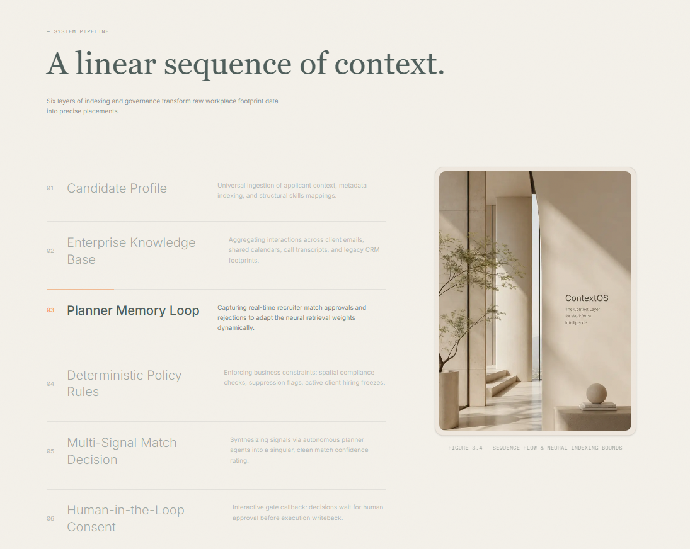
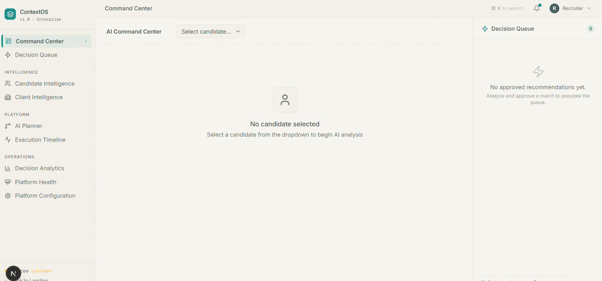
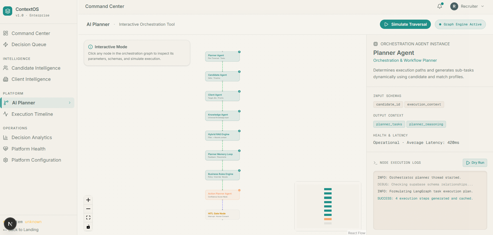
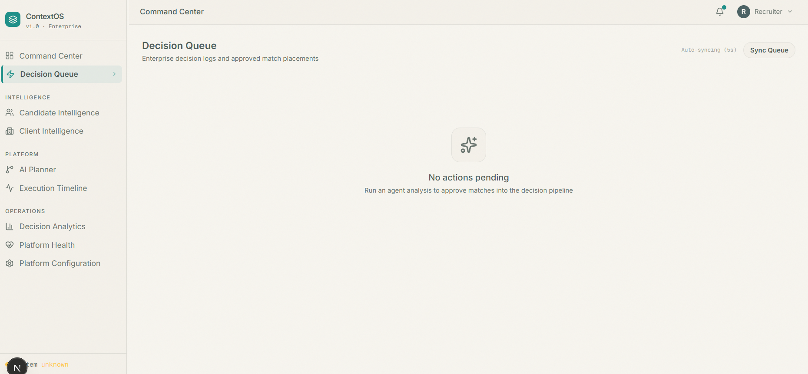
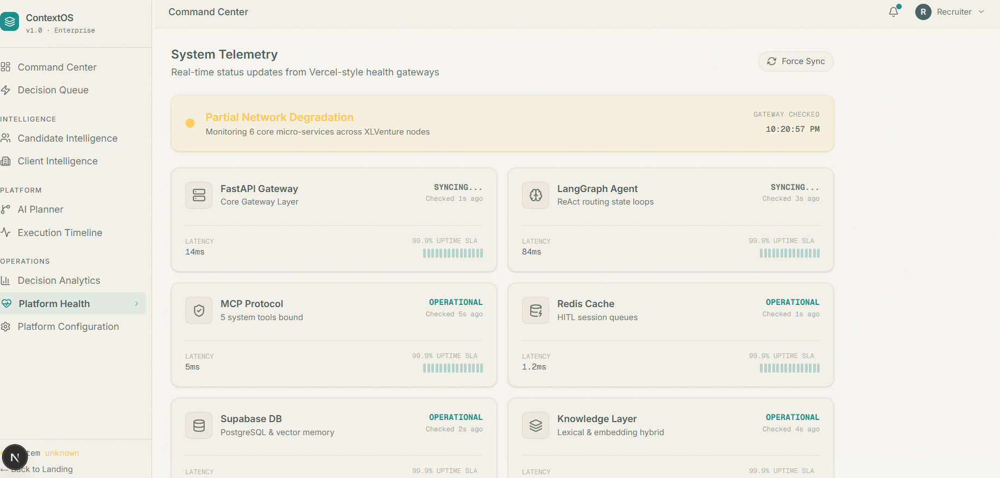
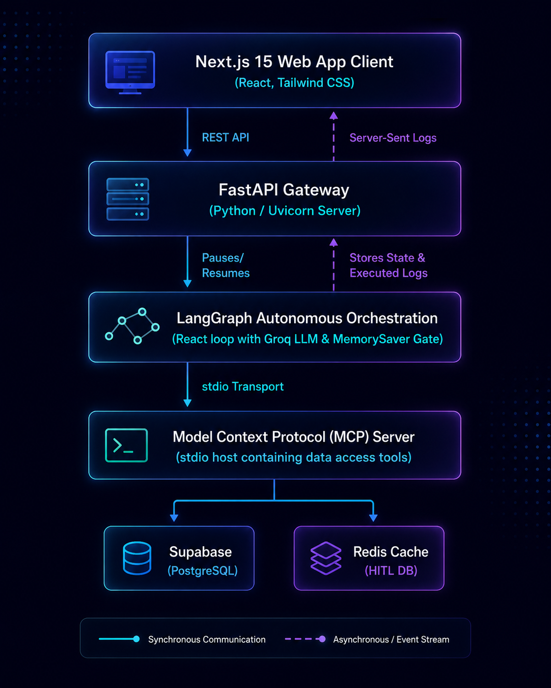

# ContextOS — Enterprise AI Operating System for Recruiting

ContextOS is a design-forward, enterprise-grade AI recruiting operating system. It merges autonomous agent reasoning, Model Context Protocol (MCP) data toolports, real-time memory loops, and human-in-the-loop safety gates into a seamless, high-performance platform.

The system connects raw corporate footprints (emails, CRM history, calendar meetings) with recruiting context, enabling teams to act on verified signals instead of presumptions.

---

## 📸 Platform Interface Gallery

### 1. Editorial Landing Page
*A technology-meets-architecture overview featuring the linear sequence pipeline grid and interactive elements.*
<!-- PLACEHOLDER: Replace the path below with your landing page screenshot -->



### 2. AI Command Center
*The primary workspace where recruiters select candidates, initiate the live ReAct reasoning stream, and approve/reject generated pitches.*
<!-- PLACEHOLDER: Replace the path below with your command center workspace screenshot -->


### 3. Interactive AI Planner
*A live visual node graph built using React Flow, mapping out real-time planner steps, tools, and execution outputs.*
<!-- PLACEHOLDER: Replace the path below with your AI planner graph screenshot -->


### 4. Decision Queue
*A ranked, high-priority feed displaying approved placements waiting for pipeline writebacks.*
<!-- PLACEHOLDER: Replace the path below with your decision queue screenshot -->


### 5. Client & Candidate Intelligence
*Detailed records showcasing parsed resume parameters, client accounts, open roles, and history.*
<!-- PLACEHOLDER: Replace the path below with your intelligence directory screenshot -->


### 6. Platform Settings & Health Dashboard
*Control panel for managing compliance thresholds, API parameters, and tracking latency or uptime.*
<!-- PLACEHOLDER: Replace the path below with your settings screenshot -->


---

## 🏛️ System Architecture


---

## 🧠 Autonomous Agent Nodes & Policies

The execution flow of a candidate evaluation runs through an **Autonomous ReAct Graph** with strict security bounds:

1. **`run_llm_agent`**: Binds database tool routes (`get_candidate_profile`, `search_job_descriptions`, `get_placement_history`) to the inference model. The agent repeatedly calls tools to assemble holistic context.
2. **`call_tools`**: Resolves tool actions requested by the agent using the **Model Context Protocol (MCP)**.
3. **`format_recommendation`**: Performs a math-based scoring logic check on skills matches, salary alignment, and location proximity.
4. **`hitl_gate`**: Saves the recommendation card state, triggers a Redis session interrupt, and pauses graph traversal.
5. **`execute_action`**: Finalizes actions upon human-in-the-loop approval, caching approved placements into the active Next Best Action (NBA) queue.

---

## ⚙️ Environment Configuration

Both backend and tests require a `.env` file containing client secrets and model keys. Create a `.env` file in the backend root directory (`/ventureai`):

```ini
# Groq Inference Key
GROQ_API_KEY=gsk_your_groq_api_key_here

# Supabase Credentials
SUPABASE_URL=https://your-project-id.supabase.co
SUPABASE_KEY=your-supabase-service-role-or-anon-key

# Redis Configuration
REDIS_URL=redis://127.0.0.1:6379/0
```

---

## 🚀 Quick Start Guide

### Prerequisites
* **Python 3.10+**
* **Node.js 18+**
* **Redis Server** (Running locally on `127.0.0.1:6379` or accessible via external URL)

---

### Step 1: Set Up Backend Virtual Environment

Navigate to the project root and activate the pre-configured Python virtual environment:

```bash
# Navigate to the workspace root directory
cd ventureai

# Activate the virtual environment (Windows PowerShell)
.\venv\Scripts\Activate.ps1

# Activate the virtual environment (macOS/Linux)
source venv/bin/activate
```

Install backend dependencies:

```bash
pip install -r requirements.txt
```

---

### Step 2: Boot the FastAPI Backend

Run the Uvicorn dev server. The backend will spin up on `http://127.0.0.1:8000`:

```bash
uvicorn main:app --host 127.0.0.1 --port 8000 --reload
```

---

### Step 3: Set Up and Run the Frontend Client

Open a new terminal window or tab, navigate to the frontend directory, install dependencies, and launch the Next.js development server:

```bash
# Navigate to the frontend directory
cd ventureai/frontend

# Install node dependencies
npm install

# Run the development server
npm run dev
```

The frontend application will boot on `http://localhost:3000`.

---

### Step 4: Run Automated Tests

To ensure database connections, MCP pathways, and LangGraph interrupts are functioning correctly, run the integration test suite:

```bash
# From the backend folder (with venv active)
pytest
```

---

## 🛠️ Codebase Structure

```
ventureai/
├── agent.py               # Autonomous LangGraph setup & node logic
├── main.py                # FastAPI REST controllers & HITL resume routes
├── mcp_server.py          # FastMCP server wrapping database tools
├── mcp_client.py          # Client transport interface for stdio spawning
├── supabase_client.py     # Base Supabase client initiator
├── redis_client.py        # Redis hooks for caching, decisions & live logs
├── requirements.txt       # Python package dependencies
├── system_handover_report.md
│
├── frontend/              # Next.js 15 workspace
│   ├── app/               # Next.js page routers & layouts
│   ├── components/        # Shared components (Sidebar, Navbar, BootScreen)
│   │   └── landing/       # Landing page sections (Hero, TechStack, etc.)
│   └── public/            # Static assets & screenshots
│
└── tests/                 # Comprehensive integration test suites
    ├── test_agent_flow.py # Tests graph state transitions & interrupts
    ├── test_mcp.py        # Tests MCP tool bindings
    └── test_api.py        # Tests endpoint parameters and request payloads
```
